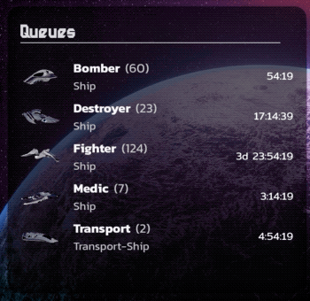

[](https://github.com/WrathChaos/react-native-countdown)

[](https://github.com/WrathChaos/react-native-countdown)

[](https://www.npmjs.com/package/freakycoder/react-native-countdown)
[](https://www.npmjs.com/package/freakycoder/react-native-countdown)

[](https://opensource.org/licenses/MIT)
[](https://github.com/prettier/prettier)

<p align="center">
  
</p>

# Installation

Add the dependency:

```js
npm i @freakycoder/react-native-countdown
```

## Peer Dependencies

###### IMPORTANT! You need install them

```js
"moment": ">= 2.24.0",
"moment-duration-format": ">= 2.3.2"
```

# Usage

## Import

```js
import moment from "moment";
import Countdown from "react-native-countdown";
```

## Usage

All Text Component feature can be send via props OR you can use textStyle

```jsx
<Countdown
  start={moment(1578240964000)}
  end={moment(1578244564000)}
  fontFamily="BurbankBigCondensed-Black" // All Text Component feature can be send via props OR you can use textStyle
  defaultCountdown=" - / - : - : -"
  format="d[d]  hh:mm:ss"
/>
```

# Configuration - Props

Check the example for the customizable `format` and `defaultCountdown` props.

| Property         |  Type   |  Default  | Description                                             |
| ---------------- | :-----: | :-------: | ------------------------------------------------------- |
| start            | boolean |   true    | make the button outline                                 |
| end              | boolean |   false   | make the button with a solid background and a shadow    |
| textStyle        | boolean |   false   | make the button with a gradient background and a shadow |
| defaultCountdown | string  | - : - : - | default countdown format before the countdown starts    |
| format           | string  | hh:mm:ss  | set your own format for the countdown                   |

## Roadmap

- [x] ~~LICENSE~~
- [ ] Typescript
- [ ] Article for Medium
- [ ] BuyMeACoffee Link/Widget

## Author

FreakyCoder, kurayogun@gmail.com

## License

React Native Countdown is available under the MIT license. See the LICENSE file for more info.
